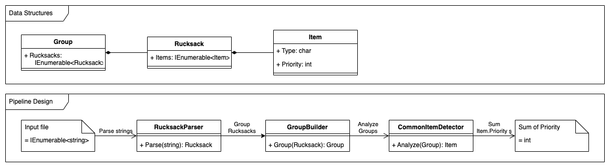

# Day 3: Rucksack Reorganization

→ [Puzzle Instructions](https://adventofcode.com/2022/day/3)

## Build and Test

See [Instructions in the parent folder](../README.md).

## Run the Application

From this folder, run the following command:

```shell
dotnet run --project Day03RucksackReorganization -- Day03RucksackReorganization/input.txt
```

## Solution Design

### Solution Design Diagram



### Algorithm Description

- Each line of the input file is sent to the `RucksackParser`.
- For every `Rucksack` the `Item`s in both `Compartment`s are analyzed for duplicates.
- For the resulting duplicate `Item`s, the `Priority` is summed up.
