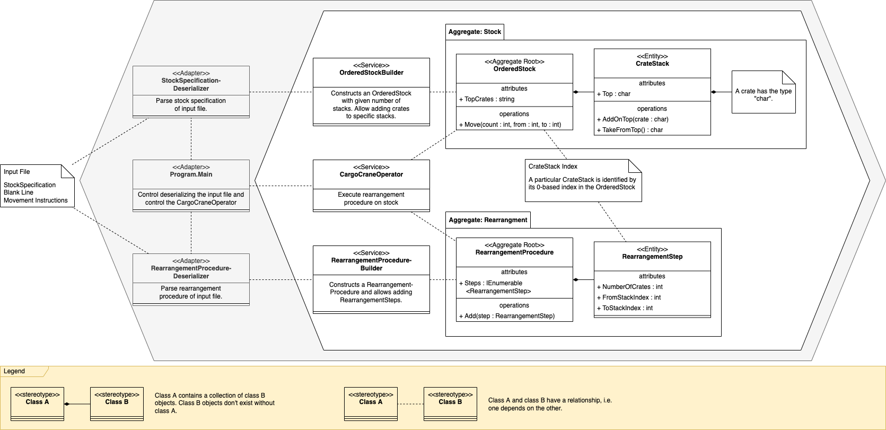

# Day 5: Supply Stacks

→ [Puzzle Instructions](https://adventofcode.com/2022/day/5)

## Build and Test

See [Instructions in the parent folder](../README.md).

## Run the Application

From this folder, run the following command to execute the application:

```shell
dotnet run --project Day05SupplyStacks -- Day05SupplyStacks/input.txt
```

## Solution Design



### Domain Model

The domain is split into two parts.

The upper part of the Domain Model diagram shows the stock and crate stack related entities.

- A crate is represented by a `char` value, which holds the crate mark.
- The stack of crates is represented by the `CrateStack`. Its `Top` crate is the one accessible for the Elves.
- The `OrderedStock` class provides the `Move` function to move crates from one `CrateStack` to an other.
  The `TopCrates` property lists the `Top` crates of the managed `CrateStack`s. The stock is considered `ordered`,
  because every `CrateStack` has a unique index.
- The `OrderedStockBuilder` allows to construct new `OrderedStock` objects using a "domain specific language".

The lower part of the Domain Model diagram shows the entities for handling the rearrangement instructions.

- A `RearrangementStep` specifies how many crates to move, from which `CrateStack` to take them and onto
  which `CrateStack` to add them. Important: The contained indexes are 0-based.
- The `RearrangementProcedure` holds the list of steps.
- The `RearrangementProcedureBuilder` allows to construct new `RearrangementProcedure` objects using a "domain specific
  language". Important: The parameters `from` and `to` are 1-based, like the contents of the input file.

### Adapters

- The `StockSpecificationDeserializer` processes the first section the input file. It uses the `OrderedStockBuilder` to
  set up the `CrateStack`s making up an `OrderedStock`.
- The `RearrangementProcedureDeserializer` processes the second part of the input file. It uses
  the `RearrangementProcedureBuilder` to add `RearrangementSteps` to a `RearrangementProcedure`.

### Domain "Services"

- The `CargoCraneOperator` executes the steps of a `RearrangementProcedure` on an `OrderedStock`.
